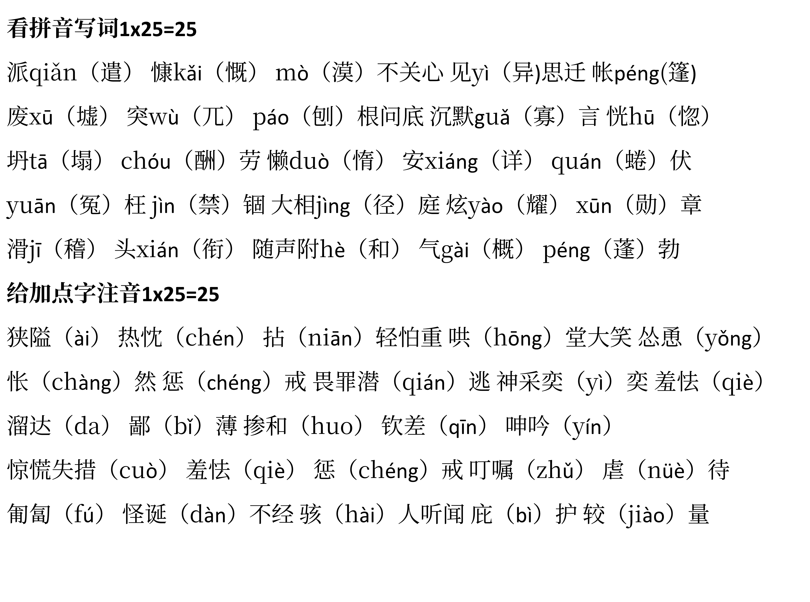
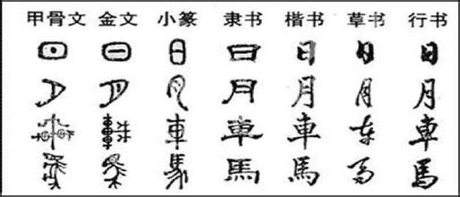

by xuanxuan1231
## 总体范围
期中后四、五、六单元（为主）  
阅读、写作、综合性学习、名著阅读《西游记》、课外古诗词诵读
## 基础语用
1.	字音字形  
4-6单元读读写写
2.	词语运用  
4-6单元读读写写

3.	词语理解  
结合语境，理解词语的意义


**
成语
**

1.	咄咄逼人：形容气势汹汹，盛气凌人，使人难堪，也指形势发展迅速，给人压力。
2.	各得其所：原指各人都得到满足。后指每个人或事物都得到恰当的位置或安排。
3.	不求甚解：意思是指只领会全文大意不在字句上过分追究，现多含贬义，形容用心不专。
甚：过分、很、极、非常：解：了解，理解。
4.	混为一谈：把不同的事物混在一起，当作同样的事物谈论。
5.	恍然大悟：对某一事物突然明白、突然醒悟。
6.	油然而生：形容思想感情自然而然地产生。
7.	以身殉职：为忠于本职工作而牺牲生命。
殉：为了某种目的而死。
8.	拈轻怕重：接受工作时挑拣轻松容易的，害怕繁重的。
9.	见异思迁：形容人意志不坚定；易受外物引诱；就变化想法。常表贬义。
迁：变动。
10.	麻木不仁：比喻对外界事物反应迟钝或漠不关心。
不仁：没有感觉。麻木：肢体麻痹，失去知觉。
11.	精益求精：比喻已经很好了，还要求更好。
精：完美；益：更加；求：追求。
12.	不毛之地：不生长草木庄稼的荒地。形容某地荒凉、贫瘠。
不毛：不长草。
13.	刨根问底：比喻追究底细。形容钻研的精神。
14.	宁静致远：只有心境平稳沉着、专心致志，才能厚积薄发、有所作为。
15.	励精图治：振奋精神，设法把国家治理好。
励：奋勉。图：谋求，设法。治：治理。
16.	畏罪潜逃：做了坏事害怕受到惩罚而逃跑。
17.	怪诞不经：指言语奇怪荒唐，不合常理。
怪诞：离奇古怪；不经：不合常理。
18.	大相径庭：比喻相差很远，大不相同。
径：小路；庭：院子；径庭：悬殊，偏激。
19.	神采奕奕：形容精力旺盛，容光焕发。奕奕：精神焕发的样子。
20.	骇人听闻：使人听了非常吃惊（多指社会上发生的凶残的事情）。
骇：震惊，使人听了非常吃惊、害怕、恐惧。闻：听。
21.	力不暇供：没有足够的力量来完成这项工作。
22.	爱慕虚荣：喜欢名利和荣耀，羡慕钱财。
爱：喜好。慕：羡慕。虚荣：本身不存在的好的事物。


4.	文学常识  
4-6单元+课外古诗词的重要作家作品


**
文学常识
**

1.	 **《纪念白求恩》** 是<u>毛泽东</u>所写。毛泽东，字<u>润之</u>，无产阶级革命家、军事家、思想家。
2.	 **《植树的牧羊人》** 节选自绘本<u>《植树的牧羊人》</u>。作者<u>让·乔诺</u>，法国（国家）作家、电影编剧。 
3.	**《走一步，再走一步》** 选自<u>《心理学与成长》</u>，作者<u>莫顿·亨特</u>，美国（国家）作家、心理学家。 
4.	**《诫子书》** 选自<u>《诸葛亮集》</u>，作者是<u>诸葛亮</u>，字<u>孔明</u>，号卧龙，三国时期蜀汉政治家和军事家。
5.	**《猫》** 选自<u>《郑振铎文集》</u>，作者是<u>郑振铎</u>，现代作家、翻译家、文学史家。
6.	**《动物笑谈》** 的作者是<u>康拉德·劳伦兹</u>，奥地利动物行为学家，科普作家，代表作有<u>《所罗门王的指环》《狗的家世》</u>。获得1973年诺贝尔生理学或医学奖。 
7. **《狼》** 选自<u>《聊斋志异》</u>，作者<u>蒲松龄</u>，字<u>留仙</u>，号<u>柳泉居士</u>，世称<u>聊斋先生</u>。清代文学家。<u>郭沫若</u>对其作品予以高度评价，“<u>写鬼写妖高人一等，刺贪刺虐入骨三分。</u>”
8.	**《皇帝的新装》选择《安徒生童话和故事选》** ，叶君健译，<u>安徒生</u>是<u>丹麦</u>著名<u>童话作家</u>。代表作有<u>《丑小鸭》《卖火柴的小女孩》《海的女儿》《皇帝的新装》</u>等。
9. **《天上的街市》** 作者<u>郭沫若</u>，四川乐山人。原名<u>郭开贞</u>。著名作家、诗人、历史学家、古文字学家。代表作有<u>诗集《女神》《星空》</u>，<u>历史剧《屈原》《虎符》《棠棣之花》</u>等。
10. **《女娲造人》** 选自<u>《神话故事新编》</u>，作者<u>袁珂</u>是四川新都人，神话学家。
11. **寓言四则**
   1. **《赫尔墨斯和雕像者》** 及**《文字和狮子》**选自<u>《伊索寓言》</u>，作者<u>伊索</u>相传是公元前6世纪的古希腊作家。所编寓言经后人加工，以诗或散文的形式结集，成为后世流传的《伊索寓言》。《伊索寓言》在世界文学史上占有重要地位，对后世的寓言创作有着深远影响。
   2. **《穿井得一人》** 选自<u>《吕氏春秋·慎行论·察传》</u>又称<u>《吕览》</u>，是先秦杂家代表著作，全书<u>二十六卷</u>，分为<u>十二纪</u>、<u>八览</u>、<u>六论</u>，共<u>一百六十篇</u>，由<u>吕不韦</u>集合门客共同编写而成。作者是吕不韦，<u>战国末年</u>著名商人、政治家、思想家，官至秦国丞相。
   3. **《杞人忧天》** 选自<u>《列子·天瑞》</u>，全书分八篇，内容多为<u>民间故事</u>、<u>寓言</u>和<u>神话传说</u>。作者<u>列子是郑国人</u>，本名<u>列御寇</u>，<u>道家学派</u>的杰出代表人物。著名思想家，文学家。
12.	**课外古诗词诵读**
   1. **《峨眉山月歌》** 作者是<u>唐代</u>的<u>李白</u>，选自《李白集校注》
   2. **《江南逢李龟年》** 作者是<u>唐代</u>的<u>杜甫</u>，选自《杜诗详注》
   3. **《行军九日思长安故园》** 作者是<u>唐代</u>诗人<u>岑参</u>，选自《岑参集校注》
   3. **《夜上受降城闻笛》** 作者是<u>唐代</u>诗人<u>李益</u>，选自《李益诗注》
   4. **《秋词（其一）》** 作者是<u>唐代</u>诗人<u>刘禹锡</u>，选自《刘禹锡集》
   4. **《夜雨寄北》** 作者是<u>唐代</u>诗人<u>李商隐</u>，选自《李商隐诗歌集解》
   5. **《十一月四日风雨大作（其二）》** 作者是<u>南宋</u>诗人<u>陆游</u>，选自《剑南诗稿校注》
   3. **《潼关》** 作者是<u>清末谭嗣同</u>，选自《谭嗣同全集》


5.	标点  
常用标点符号（顿号、逗号、句号、分号）


**顿号：用于并列词语之间，表示停顿。**  
**逗号：用于复句内，各分句之间的停顿。**  
**分号：用于复句内并列关系的分句之间。**  
**句号：用于句尾，表示陈述语气，表示这句话已经说完。**  

1. 顿号是句子内部最小的停顿，常用在并列的词或短语之间（分句之间不能用顿号）。但并列性的谓语、补语之间不用顿号，只用逗号。

这个省今年的水利建设，任务重，工程难，规模大。  
你要不断地进步，识字，生产。  
他的故事讲得真实，感人。  

2. 带语气词的并列词语之间不用顿号，只用逗号。

这里的山啊，水啊，树啊，草啊，都是我从小就熟悉的。

3. 并列词语中已使用连词“和、或、及、与”等，不能再用顿号。

我国科学、文化、卫生、教育和新闻出版业有了很大发展。（一般情况下，并列词语的最后两项使用连词而不用顿号）
d
4. 相邻的数字表示约数，不用顿号。

他已经走了有三四里的路了。

**要区别于表示两种并列的情况。**  
国内的大学要求学生在一、二年级时都必须选修一门外语。


5. 集体词语之间关系紧密，不用顿号分隔。

公安干警、中小学生、大专院校、男女老少等。

6. 表并列性的引号、书名号之间不用顿号。

近期我观看了许多出色的电影，如《英雄》《无间道》《美丽人生》等。  
这时课堂里响起了“向孔繁森学习”“向孔繁森致敬”的口号。

7. 并列词语注意分类，小的用顿号，大的用逗号；分句间小的用逗号，大的用分号，甚至句号。

原子弹、氢弹的爆炸，人造卫星的发射、回收，标志着我国科学技术的发展达到了新的水平。  
一个漂亮的姑娘，个儿要高，又不能太高。  
脸要白，又不能太白；要白里透红，又不能太红。  
我国许多图书馆年经费仅一二万元，除去工资、办公费用，购书费可以想见还有多少。

8. 分号一般是用在复句内部的并列分句之间；但如果分句之间没有逗号，不可以直接使用分号。

语言，人们用来抒情达意；文字，人们用来记言记事。  
我们过苦日子时，他来了；我们过好日子时，他却走了。  
天才出于勤奋，知识在于积累。

9. 非并列关系的多重复句，第一层关系处也用分号。

这样的人往往经验很多，这是很可贵的；但是，如果他们就以自己的经验为满足，那也很危险。




6.	句子  
关注前后语境，选取恰当句子回填（陈述句、疑问句、感叹句、祈使句）

1. 陈述句
指陈述一个事实或者说话人的看法的句型。陈述句又分为肯定句与否定句。陈述句的句末用句号。

**肯定** 孩子是我一生的牵挂。  
**否定** 这颗苹果不是我摘下来的。  

2. 疑问句
提出问题，咨询情况。

你一直在这吗？  
他不是会开车吗？  
他不是学生吗？     

3. 感叹句
表示喜怒哀乐等强烈情感的句子。

你真是勤奋呀！

4. 祈使句
表示请求、命令、叮嘱、希望，要对方做或不做某事、带有祈使语气的句子。

快找个凳子坐下吧！  
您请坐啊！  
别动！  
要好好听老师话啊！


7.	修辞  
比喻、比拟、排比、夸张

1. 明喻  
本体（被比喻的事务）和喻体（用来做比喻的事物）之间用“像”“好像”“仿佛”“如同”“……似的”等比喻词链接。

**看，像牛毛，像花针，像细丝，密密地斜织着，人家屋顶上全笼着一层薄烟。**  
这里连用三个比喻，把春雨比作牛毛、花针、细丝，都是形容春雨“密”的特点。通过印象的叠加，强化了表达效果，表达了作者对春雨的喜爱之情。

2. 暗喻  
本体和喻体之间用“是”“就是”“变成”“成为”“等于”等词语，或者用破折号来链接。

**小孩的笑脸就是太阳。**  
运用了比喻的修辞手法，将小孩的笑脸比喻成太阳，突出了小孩笑容的天真灿烂，表达了作者对小孩笑脸的喜欢。

3. 借喻  
本体和喻体都不出现，而是借用喻体直接代替本体。

**不要随便给人扣帽子。**  
运用了借喻的修辞手法，把罪名或坏名比作帽子，让抽象的事物具体化，形象生动。

2. 拟人  
把物当作人来写，赋予物以人的动作行为或思想感情的修辞手法。

**这一圈小山在冬天特别可爱，好像是把济南放在一个小摇篮里，他们全安静不动地低声地说：“你们放心吧，这儿准保暖和。”**  
赏运用了拟人的修辞手法，通过小山的语言，突出了小山的可爱与可靠，表达了作者对济南的小山的喜爱之情。

3. 排比  
把三个或以上意义相关或相近、结构相同或相似、语气相同的词组或句子并排在一起组成的句子。一般使用排比句来说理，可收到条理分明的效果；用排比来抒情，节奏和谐，显得感情洋溢、气势更为强烈。

**在那田垄里埋葬过我的欢笑，在那稻棵上我捉过蚱蜢，在那沉重的镐头上有我的手印。**  
赏运用了排比的修辞手法，三个“在那……”情感强烈，增强语势，表达了作者对故土的热爱和怀念之情。


4. 夸张  
定义：对人或事做扩大、缩小或超前的描述，以强调或突出某一方面的特点。
   1. 扩大的夸张

**托尔斯泰这对眼睛里有一百只眼珠。**  
扩大的夸张，表现出托尔斯泰强大敏锐的观察能力。

   2. 缩小的夸张

**一个浑身黑色的人，站在老栓面前，眼光正像两把刀，刺得老栓缩小了一半。**  
缩小的夸张，刻画出刽子手的凶恶残暴和老栓的怯懦。

   3. 超前的夸张

**他还未表演，心早就热了。**  
超前的夸张，写出了“他”心中的温度，和等待表演的紧张。



8.	病句  
成分残缺、搭配不当

1. 成分残缺
   1. 缺主语

**看到同志们的认真负责，使我很受教育。**  
滥用介词导致主语残缺，可删去“看到”或“使”。

   2. 缺谓语

**网购是当前最时尚的一种购物方式，人们可以在网络平台上一系列的交易活动。**  
缺谓语，应在“网络平台上”后加上进行。

   3. 缺宾语

**很多家长努力为孩子争取上台演出。**  
缺宾语，应在“演出”后加上“的机会”。

   4. 缺关联词语

**这次学术会，时间并不长，收获很大。**  
缺关联词，应加入关联词“虽然……但是……”。

2. 搭配不当
   1. 主谓搭配不当

**全场的目光和掌声都集中到竖立在主席台前的旗杆上。**  
“掌声”是不能“集中到旗杆上”的，可以删去“和掌声”。

   2. 动宾搭配不当

**优秀的中华传统文化是有灵气的，它已经融入了我们的文化性格里，启动着我们的心智，滋养着我们的心灵。**  
“启动”和“心智”搭配不当，应将“启动”改为“启迪”或“启发”。

   3. 主宾搭配不当

**你们的钢铁之躯为万家和乐奉献着自己的青春。**  
提取句子主干为“钢铁之躯奉献青春”。“钢铁之躯”与“青春”搭配不当，可将“你们的钢铁之躯”改为“你们凭借钢铁之躯”。

   4. 修饰语与中心语搭配不当

**南极洲恐龙化石的发现，强烈地证明地壳在进行缓慢但又不可抗拒的运动。**  
状语“强烈”与中心语“证明”搭配不当，可改为“有力”。

   5. 一面与两面搭配不当

**绿色发展是构建高质量现代化经济体系的必然要求，是能否解决污染问题的根本之策。**  
“是……”表示一面，“能否”表示两面，应将“能否”删掉。

   6. 关联词搭配不当

**语文学习不是一朝一夕的事，只要多度多写，日积月累，才能真正学好语文。**  
“只要”与“才”搭配不当，应将“只要”改为“只有”。



9.	书法  
书体辨识与选用


**公式**  
字体+形象分析题：选择+字体+字体特点+结合形象。  


**例**    
我选择【甲】楷书。楷书端庄大气、横平竖直，方正严谨、刚健坚劲，与材料“他是倔强的斗士、冷峻的批判者、信念坚定的先觉者、伟大的精神导师于一身的大先生”塑造的鲁迅冷峻且热忱的形象相符。
    1. 篆书
    字形呈长方形，匀称对称，布局严谨，古朴典雅，圆润自然、苍古质朴。
    1. 隶书
    字形稍扁，蚕头燕尾、笔画直立，有粗有细，横长直短，敦厚大气，雄浑庄重，宽扁稳重，厚重严整。
    1. 草书
    笔画省简，飘逸潇洒，龙飞凤舞，奔放自如。
    1. 楷书
    形体方正，刚健坚韧，端庄大气，端庄秀雅，方正严谨。
    1. 行书
    舒展有型，灵活多变，行云流水，笔意通畅。

## 古诗文阅读
### 默写范围
《观沧海》《闻王昌龄左迁龙标遥有此寄》《次北固山下》  
《天净沙秋思》《诫子书》《秋词》《夜雨寄北》  
《十一月四日风雨大作》《潼关》
### 古诗阅读
1. 范围  
《秋词》《夜雨寄北》《十一月四日风雨大作》《潼关》
2. 方式  
课内外古诗连读
3. 题型  
选择题、简答题
4. 考点  
品味诗歌内容，体悟诗人情感  
结合创作背景，知人论诗，把握诗歌主题
### 古文阅读
1. 范围  
《诫子书》《狼》《穿井得一人》《杞人忧天》课内外文言文联读
2. 题型  
选择题、简答题
3. 考点  
一词多义、语句翻译及理解、内容理解
 
## 名著阅读
1. 范围  
《西游记》
2. 考点  
主要情节、主要人物形象、小说主题  
以适当的考查方式引导学生从名著阅读中获取人生滋养

 
## 实用文本阅读
1. 文本  
说明性非连文本，说明性文字语段、表格
2. 考点  
图文信息转换、信息确认、信息提取和概括
## 文学阅读
1. 文本  
叙事写物散文
2. 考点  
   1.	整体感知  
   能通过划分段落层次、抓住关键语句等方式，理清作者思路，概括段落大意
   2.	品味词语  
   参照[《纪念白求恩》课后练习四](#纪念白求恩课后练习四)
   3.	句段理解  
   参照[《植树牧羊人》课后练习三](#植树的牧羊人课后练习三)、[《猫》课后练习二](#猫课后练习二)、[四](#猫课后练习三)
   4.	分析综合、形成解释
   能够基于文本，通过阅读对文中重要内容、思想感情做出合理、多角度解释。
### 《纪念白求恩》课后练习四
**品味下列语句，体会其表达效果。并尝试仿写句子，用上加点的词语。**
1.	从前线回来的人说到白求恩，没有一个不佩服，没有一个不为他的精神所感动。  

**参考答案** 此处连用两个双重否定句，极其有力地强调了无一例外，每个人都佩服，每个人都感动的事实，这比一般的陈述句显得更斩钉截铁不可动摇。

2.	一个人能力有大小，但只要有这点精神，就是一个高尚的人，一个纯粹的人，一个有道德的人，一个脱离了低级趣味的人，一个有益于人民的人。  

**参考答案** 充分发挥“大有利于人民”这个意思，具体精微地分析阐述为五个方面，用5个短语“一个....的人”组成一组排比，议论热情洋溢，语气非常流畅，收束非常有力。

### 《植树的牧羊人》课后练习三
**首尾两段是作者对牧羊人的评价，前后呼应。阅读这两段，参考下面的文字，谈谈你对课文主题的认识。**  
它的文字、它的图，都让人感动，鼓舞人们去做对我们这个地球有益的事，这个地球上神奇的人和事真是数也数不完！祝愿大家都有一颗慷慨的心，和别人分享，给自己带来幸福。

——绘本《植树的男人》绘画作者给中国读者的寄语


**参考答案**  
1. 本文通过讲述牧羊人用双手把荒原变成绿洲，使万人享受幸福生活的故事，表达了一种保护自然、改善自然的思想，呼吁人们只要坚持不懈地种树，辛勤耕耘，就一定会收获幸福。
2. 牧羊人即使在最令人绝望的荒原，经历了战争的破坏，也依然怀揣最美好的愿望。他坚持种树创造奇迹的壮举，让我们相信：只要坚守信念，就一定会实现自己的理想。
3. 牧羊人植树心无旁骛，不动摇，不怀疑，不因外在环境的干扰而放弃自己的目标。这告诉我们只要坚持不懈，目标就一定会实现。


### 《猫》课后练习二
**第一只猫死后，“我”安慰三妹说：“不要紧，我再向别处要一只来给你。”第三只猫丢失后，作者写道：“自此，我家好久不养猫。”第三只猫死后，作者又写道：“自此，我家永不养猫。”这三句话在文章结构上起什么作用？**  

**参考答案**
1. 第一句话表现了这只猫的死带给我们的感受，虽然难过，但还不至于太伤心，也为后面第二只猫的到来做铺垫。
2. 第二句话表示我们全家伤心的程度加深了，在结构上起着总结上文的作用，又为下文被动收养流浪猫做了铺垫。
3. 第三句话比上一句程度更深，一个“永不”显示了作者态度的决绝，放在文章最后，既呼应了开头，又开拓了文意，也是对全文的总结。


### 《猫》课后练习三
**第三只猫“大家都不喜欢它”，但它亡失之后，“我”却“更难过得多”。你觉得原因是什么？仅仅是因为“我”冤枉了它吗？**  

**参考答案**
1. 论来历，第三只猫本是被人遗弃的，是我家出于怜悯拾来的；而第一只猫是从隔壁要来的，第二只猫是特地从舅舅家要来的。相比之下，第三只猫来得更随意，甚至有些无奈。
2. 论外形，第三只猫毛色花白，并不好看，又很瘦，烧脱了好几块毛之后，样子更难看了；第一只猫则白雪球似的可爱，第二只猫浑身黄色，也很可爱。相比之下，第三只猫从外貌就不讨人喜欢。
3. 论性情，第三只猫不活泼，忧郁，懒惰，第一只猫很活泼，第二只猫更加活泼。所以第三只猫并没有如前两只猫给家人带来许多欢乐。
3. 论在家中的地位，第三只猫是若有若无的，大家不大喜欢，不大注意它，第一只猫、第二只猫则是全家的宠物。
3. “我”对于第三只猫的死更感到难过的原因，是因为第三只猫的死，责任在“我”。“我”主观臆断，认定鸟是它咬死的，暴怒之下，用木棒打它，它受到冤苦却无法辩诉，最后死在邻家的屋脊上，“我”认为是“我”把它害死的，而且这个过失是无法补救的。
3. 从这件事中，“我”意识到光凭个人的好恶，带着私人的偏见去对待第三只猫是多么的不公平，因而良心受到谴责，追悔莫及。这一点是与文章主旨紧密相连的。作者写猫，并不仅仅局限于猫本身，而是借此阐发了人生哲理，揭示了关爱动物、爱护弱小、反思人类自身弱点的主题，也体现了作者勇于自我反思的自省意识，以及知识分子悲天悯人的宽厚情怀。

## 作文
1. 范围  
**第四单元** 思路要清晰  
**第五单元** 如何突出中心  
**第六单元** 发挥联想想象  
2. 考点
   1. 记叙文写作，全命题作文
   2. 想象文写作，全命题作文

