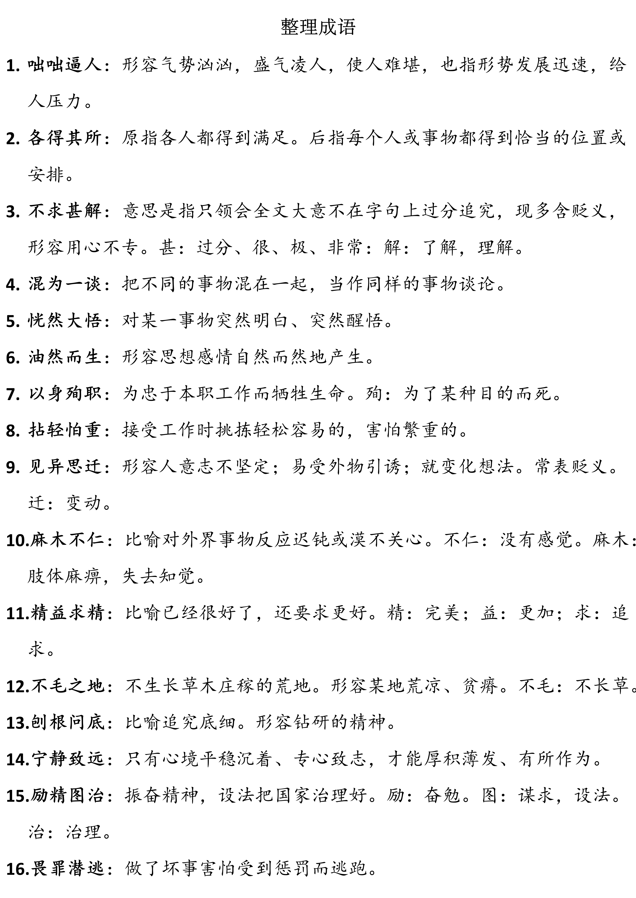
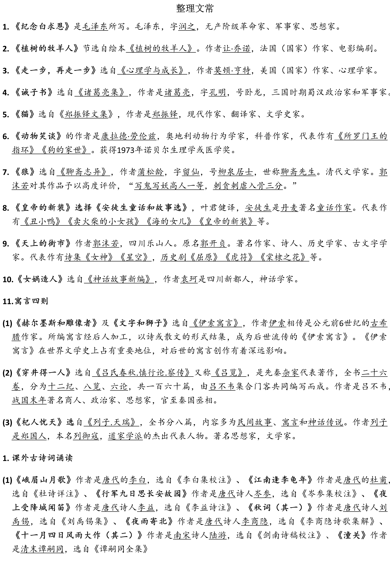
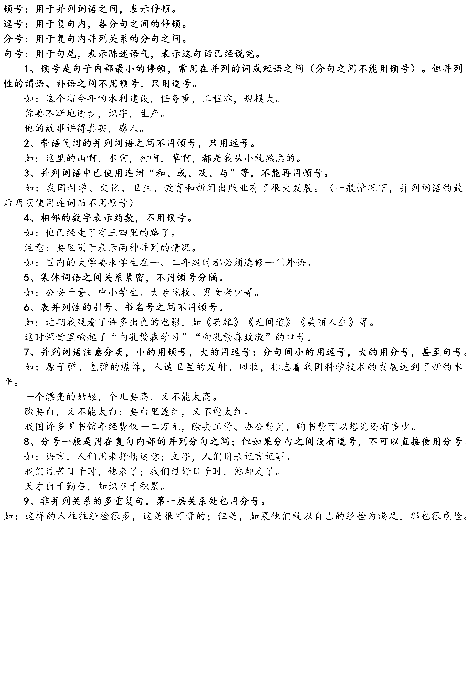
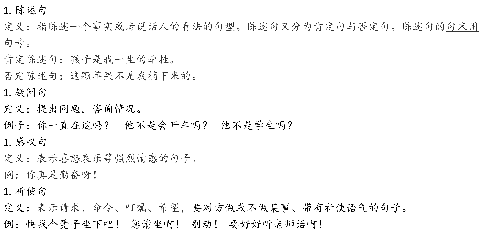
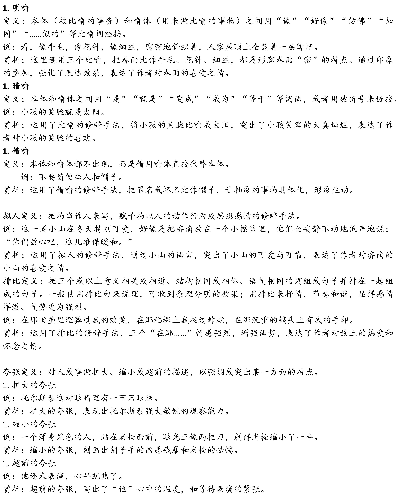

# 语文复习资料（by xuanxuan1231）
## 总体范围
期中后四、五、六单元（为主）  
阅读、写作、综合性学习、名著阅读《西游记》、课外古诗词诵读
## 基础语用
1.	字音字形
4-6单元读读写写
2.	词语运用
4-6单元读读写写

3.	词语理解
结合语境，理解词语的意义

4.	文学常识
4-6单元+课外古诗词的重要作家作品

5.	标点
常用标点符号（顿号、逗号、句号、分号）

6.	句子
关注前后语境，选取恰当句子回填（陈述句、疑问句、感叹句、祈使句）

7.	修辞
比喻、比拟、排比、夸张

8.	病句
成分残缺、搭配不当

9.	书法
书体辨识与选用

**公式**  
字体+形象分析题：选择+字体+字体特点+结合形象。  
**例**    
我选择【甲】楷书。楷书端庄大气、横平竖直，方正严谨、刚健坚劲，与材料“他是倔强的斗士、冷峻的批判者、信念坚定的先觉者、伟大的精神导师于一身的大先生”塑造的鲁迅冷峻且热忱的形象相符。
    1. 篆书
    字形呈长方形，匀称对称，布局严谨，古朴典雅，圆润自然、苍古质朴。
    1. 隶书
    字形稍扁，蚕头燕尾、笔画直立，有粗有细，横长直短，敦厚大气，雄浑庄重，宽扁稳重，厚重严整。
    1. 草书
    笔画省简，飘逸潇洒，龙飞凤舞，奔放自如。
    1. 楷书
    形体方正，刚健坚韧，端庄大气，端庄秀雅，方正严谨。
    1. 行书
    舒展有型，灵活多变，行云流水，笔意通畅。

## 古诗文阅读
### 默写范围
《观沧海》《闻王昌龄左迁龙标遥有此寄》《次北固山下》  
《天净沙秋思》《诫子书》《秋词》《夜雨寄北》  
《十一月四日风雨大作》《潼关》
### 古诗阅读
1. 范围
《秋词》《夜雨寄北》《十一月四日风雨大作》《潼关》
2. 方式
课内外古诗连读
3. 题型
选择题、简答题
4. 考点
品味诗歌内容，体悟诗人情感
结合创作背景，知人论诗，把握诗歌主题
### 古文阅读
1. 范围
《诫子书》《狼》《穿井得一人》《杞人忧天》课内外文言文联读
2. 题型
选择题、简答题
3. 考点
一词多义、语句翻译及理解、内容理解
 
## 名著阅读
1. 范围
《西游记》
2. 考点
主要情节、主要人物形象、小说主题  
以适当的考查方式引导学生从名著阅读中获取人生滋养

 
## 实用文本阅读
1. 文本
说明性非连文本，说明性文字语段、表格
2. 考点
图文信息转换、信息确认、信息提取和概括
## 文学阅读
1. 文本
叙事写物散文
2. 考点
   1.	整体感知：能通过划分段落层次、抓住关键语句等方式，理清作者思路，概括段落大意
   2.	品味词语：参照[《纪念白求恩》课后练习四](#纪念白求恩课后练习四)
   3.	句段理解：参照[《植树牧羊人》课后练习三](#植树的牧羊人课后练习三)、[《猫》课后练习二](#猫课后练习二)、[四](#猫课后练习三)
   4.	分析综合、形成解释：能够基于文本，通过阅读对文中重要内容、思想感情做出合理、多角度解释。
### 《纪念白求恩》课后练习四
**品味下列语句，体会其表达效果。并尝试仿写句子，用上加点的词语。**
1.	从前线回来的人说到白求恩，没有一个不佩服，没有一个不为他的精神所感动。  
**参考答案** 此处连用两个双重否定句，极其有力地强调了无一例外，每个人都佩服，每个人都感动的事实，这比一般的陈述句显得更斩钉截铁不可动摇。
2.	一个人能力有大小，但只要有这点精神，就是一个高尚的人，一个纯粹的人，一个有道德的人，一个脱离了低级趣味的人，一个有益于人民的人。  
**参考答案** 充分发挥“大有利于人民”这个意思，具体精微地分析阐述为五个方面，用5个短语“一个....的人”组成一组排比，议论热情洋溢，语气非常流畅，收束非常有力。
### 《植树的牧羊人》课后练习三
**首尾两段是作者对牧羊人的评价，前后呼应。阅读这两段，参考下面的文字，谈谈你对课文主题的认识。**  
它的文字、它的图，都让人感动，鼓舞人们去做对我们这个地球有益的事，这个地球上神奇的人和事真是数也数不完！祝愿大家都有一颗慷慨的心，和别人分享，给自己带来幸福。

——绘本《植树的男人》绘画作者给中国读者的寄语

**参考答案**  
1. 本文通过讲述牧羊人用双手把荒原变成绿洲，使万人享受幸福生活的故事，表达了一种保护自然、改善自然的思想，呼吁人们只要坚持不懈地种树，辛勤耕耘，就一定会收获幸福。
2. 牧羊人即使在最令人绝望的荒原，经历了战争的破坏，也依然怀揣最美好的愿望。他坚持种树创造奇迹的壮举，让我们相信：只要坚守信念，就一定会实现自己的理想。
3. 牧羊人植树心无旁骛，不动摇，不怀疑，不因外在环境的干扰而放弃自己的目标。这告诉我们只要坚持不懈，目标就一定会实现。
### 《猫》课后练习二
**第一只猫死后，“我”安慰三妹说：“不要紧，我再向别处要一只来给你。”第三只猫丢失后，作者写道：“自此，我家好久不养猫。”第三只猫死后，作者又写道：“自此，我家永不养猫。”这三句话在文章结构上起什么作用？**
  
**参考答案**
1. 第一句话表现了这只猫的死带给我们的感受，虽然难过，但还不至于太伤心，也为后面第二只猫的到来做铺垫。
2. 第二句话表示我们全家伤心的程度加深了，在结构上起着总结上文的作用，又为下文被动收养流浪猫做了铺垫。
3. 第三句话比上一句程度更深，一个“永不”显示了作者态度的决绝，放在文章最后，既呼应了开头，又开拓了文意，也是对全文的总结。

### 《猫》课后练习三
**第三只猫“大家都不喜欢它”，但它亡失之后，“我”却“更难过得多”。你觉得原因是什么？仅仅是因为“我”冤枉了它吗？**
  
**参考答案**
1. 论来历，第三只猫本是被人遗弃的，是我家出于怜悯拾来的；而第一只猫是从隔壁要来的，第二只猫是特地从舅舅家要来的。相比之下，第三只猫来得更随意，甚至有些无奈。
2. 论外形，第三只猫毛色花白，并不好看，又很瘦，烧脱了好几块毛之后，样子更难看了；第一只猫则白雪球似的可爱，第二只猫浑身黄色，也很可爱。相比之下，第三只猫从外貌就不讨人喜欢。
3. 论性情，第三只猫不活泼，忧郁，懒惰，第一只猫很活泼，第二只猫更加活泼。所以第三只猫并没有如前两只猫给家人带来许多欢乐。
3. 论在家中的地位，第三只猫是若有若无的，大家不大喜欢，不大注意它，第一只猫、第二只猫则是全家的宠物。
3. “我”对于第三只猫的死更感到难过的原因，是因为第三只猫的死，责任在“我”。“我”主观臆断，认定鸟是它咬死的，暴怒之下，用木棒打它，它受到冤苦却无法辩诉，最后死在邻家的屋脊上，“我”认为是“我”把它害死的，而且这个过失是无法补救的。
3. 从这件事中，“我”意识到光凭个人的好恶，带着私人的偏见去对待第三只猫是多么的不公平，因而良心受到谴责，追悔莫及。这一点是与文章主旨紧密相连的。作者写猫，并不仅仅局限于猫本身，而是借此阐发了人生哲理，揭示了关爱动物、爱护弱小、反思人类自身弱点的主题，也体现了作者勇于自我反思的自省意识，以及知识分子悲天悯人的宽厚情怀。
## 作文
1. 范围  
**第四单元** 思路要清晰  
**第五单元** 如何突出中心  
**第六单元** 发挥联想想象  
2. 考点
   1. 记叙文写作，全命题作文
   2. 想象文写作，全命题作文

